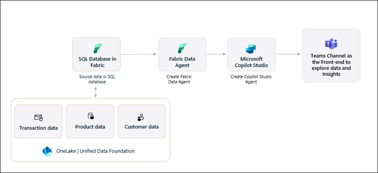
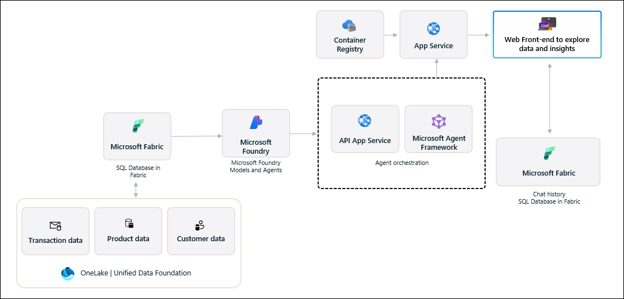
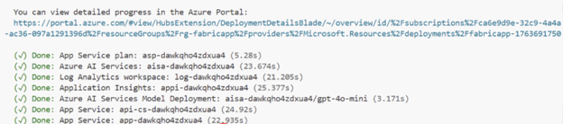
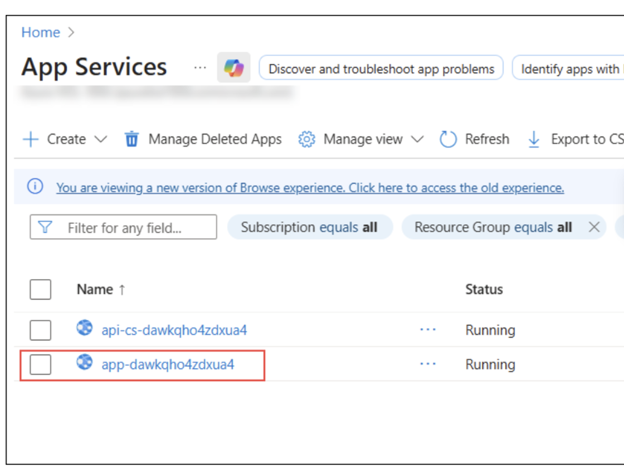
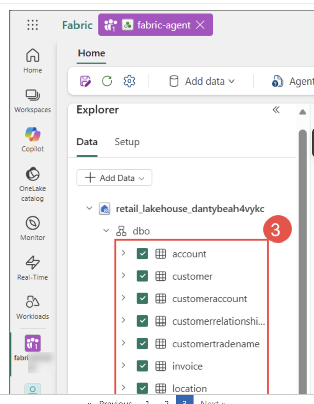
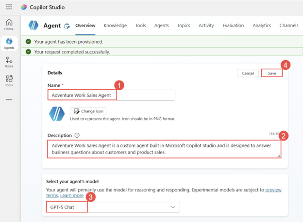
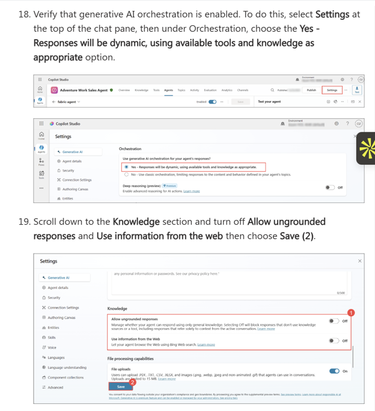
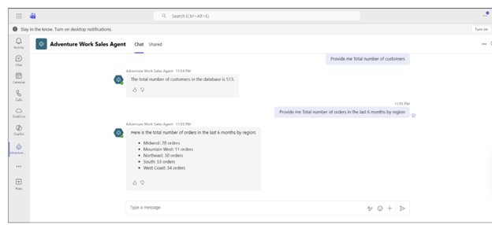

# 🤖 Chat with Your Data — Microsoft Fabric Agentic AI

**Workshop:** Microsoft Unified Data Foundation (UDF) Solution Accelerator  
**Format:** Hands-on instructor-led lab (4 hours)  
**Date:** June 2026  
**Author:** Shubham Mittal

---

## What This Is

A hands-on workshop where I built and deployed a production-grade agentic AI solution on Microsoft Fabric — connecting enterprise data stored in OneLake all the way to a conversational AI agent accessible inside Microsoft Teams.

By the end, you could type a plain English question into Teams and get a live answer pulled from a structured Fabric SQL database in under 10 seconds.

---

## Architecture

### Lab 1 — Teams / Copilot Studio Path



> OneLake stores transaction, product, and customer data. A Fabric SQL Database exposes it to a Fabric Data Agent. Microsoft Copilot Studio wraps that agent and publishes it to Microsoft Teams as a conversational interface.

### Lab 2 — Azure Web App Path



> A parallel path using Microsoft Foundry, Azure App Service (containerized), and Microsoft Agent Framework to serve a web-based frontend. Chat history is persisted back to Fabric SQL Database.

---

## What I Built

### Lab 1: Fabric-Integrated AI Application on Azure (~120 min)

**Goal:** Provision the full Azure + Fabric infrastructure and validate end-to-end via a web frontend.

**Steps completed:**
- Created a Microsoft Fabric workspace linked to a Copilot-enabled capacity
- Deployed full Azure infrastructure using Bicep templates via `azd up` in GitHub Codespaces

**Deployment output — all resources provisioned successfully:**



Resources provisioned:
- Azure AI Services (aisa-*)
- Log Analytics Workspace
- Application Insights
- Azure AI Services Model Deployment (GPT-4o-mini)
- API App Service (api-cs-*)
- Web App Service (app-*)

**Both App Services running:**



- Configured Microsoft Entra ID authentication on Azure App Service (Create new app registration, 180-day secret expiration)
- Ran post-deployment bash scripts to configure agents and Fabric components
- Validated end-to-end solution via natural language queries on the deployed web frontend

---

### Lab 2: Fabric Data Agent + Copilot Studio → Teams (~120 min)

**Goal:** Create a Fabric Data Agent, wire it into a Copilot Studio agent, and publish to Microsoft Teams.

#### Step 1 — Fabric Data Agent with Lakehouse tables

Connected the agent to `retail_lakehouse` with 8+ tables selected:



Tables connected: `account`, `customer`, `customeraccount`, `customerrelationship`, `customertradename`, `invoice`, `location`, `orderline`, `orderpayment`, `orders`

#### Step 2 — Custom Agent in Microsoft Copilot Studio

Configured the **Adventure Work Sales Agent** using GPT-5 Chat model:



- Agent name: **Adventure Work Sales Agent**
- Model: **GPT-5 Chat**
- Connected to Fabric Data Agent via **MCP (Model Context Protocol)**

#### Step 3 — Generative AI Orchestration + Knowledge Settings



Key configuration decisions:
- **Generative AI Orchestration:** ON — responses are dynamic, using available tools and knowledge
- **Allow ungrounded responses:** OFF — agent can only answer from connected data (critical for enterprise use)
- **Use information from the Web:** OFF — pure data-grounded answers only

#### Step 4 — Published to Teams and validated with live queries



**Query 1:** "Provide me the total number of customers"  
**Response:** The total number of customers in the database is **513**

**Query 2:** "Provide me the total number of orders in the last 6 months by region"  
**Response:**
- Midwest: 28 orders
- Mountain West: 11 orders
- Northeast: 30 orders
- South: 53 orders
- West Coast: 34 orders

Agent response time: **~9 seconds** end-to-end through Teams → Copilot Studio → MCP → Fabric SQL → response

---

## Key Technologies

| Layer | Technology |
|---|---|
| Data storage | Microsoft Fabric OneLake, Fabric SQL Database |
| Infrastructure-as-code | Azure Bicep, Azure Developer CLI (`azd`) |
| Development environment | GitHub Codespaces |
| AI orchestration | Microsoft Copilot Studio (GPT-5 Chat), MCP Server |
| AI models | Azure AI Services, GPT-4o-mini (deployment) |
| Backend services | Azure App Service, Container Registry, Microsoft Foundry |
| Monitoring | Log Analytics Workspace, Application Insights |
| Interface | Microsoft Teams, Web frontend |
| Auth | Microsoft Entra ID (end-user credentials flow) |

---

## What I Learned

**1. MCP is the connective tissue**  
Copilot Studio connects to the Fabric Data Agent via Model Context Protocol — not a custom API, not a webhook. This is what makes multi-agent composition possible without glue code.

**2. "Allow ungrounded responses = Off" is the most important enterprise setting**  
Turning this off means the agent cannot hallucinate answers from general knowledge. It must ground every response in the connected data source. For any production analytics use case, this is non-negotiable.

**3. Bicep + `azd` makes the whole stack reproducible**  
The entire Azure infrastructure — 6 services — was provisioned in under 10 minutes from a single `azd up` command. This is the right pattern for enterprise AI deployments.

**4. End-user credential auth vs. service account auth**  
The Copilot Studio → Fabric Data Agent connection uses end-user credentials by design. This means data access respects the individual user's Fabric permissions — not a shared service identity. Important governance distinction.

**5. Fabric Data Agent = governed natural language layer over SQL**  
You define exactly which tables the agent can see. The agent translates natural language into SQL under the hood. The governance layer (which tables, which schema) stays in your control.

---

## Relevance to My Work

At DSRS (UIUC), we currently have multiple data sources feeding an AI-powered hiring platform, with stakeholder questions that require manual SQL pulls each time. This architecture is a direct blueprint for building a governed, conversational analytics layer on top of that data — where stakeholders ask questions in plain English and get grounded, real-time answers without waiting for a data analyst to write a query.

---

## Repository Structure

```
/
├── README.md                          ← This file
├── screenshots/
│   ├── 01_architecture_teams_flow.png
│   ├── 02_architecture_azure_backend.png
│   ├── 03_azure_deployment_success.png
│   ├── 04_app_services_running.png
│   ├── 05_fabric_data_agent_tables.png
│   ├── 06_copilot_studio_agent_gpt5.png
│   ├── 07_orchestration_settings.png
│   └── 08_teams_live_queries_final.png
└── notes/
    └── key_commands.md                ← CLI commands used during the lab
```

---

## Key Commands Used

```bash
# Authenticate to Azure
azd auth login

# Provision and deploy all Azure infrastructure
azd up
# → Enter environment name: fabricapp
# → Select subscription: 1
# → Select region: East US 2
# → Backend runtime: dotnet
# → Use case: Retail-sales-analysis
# → Resource group: rg-fabricapp

# Run post-deployment agent setup script
bash ./infra/scripts/agent_scripts/run_create_agents_scripts.sh

# Run post-deployment Fabric items setup (replace with your workspace ID)
bash ./infra/scripts/fabric_scripts/run_fabric_items_scripts.sh <fabric-workspaceId>

# Tear down all resources when done
azd down
```

---

*Part of my ongoing exploration of enterprise AI architectures. Connect on [LinkedIn](https://linkedin.com/in/shubham--mittal) or visit [shubham-mittal.com](https://shubham-mittal.com)*
